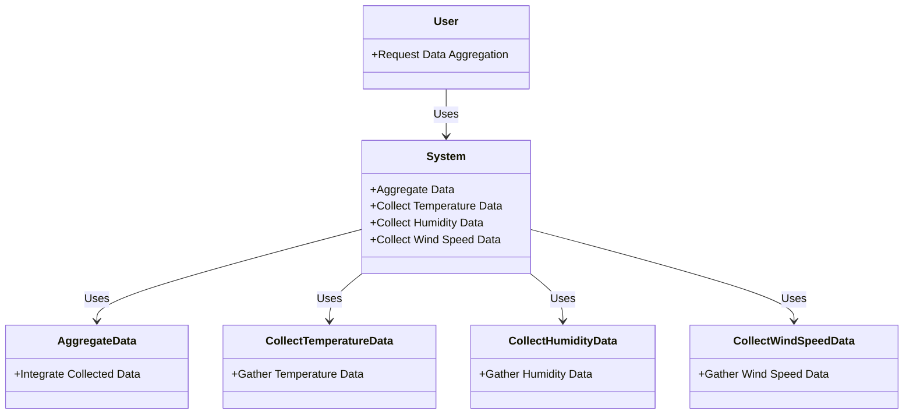
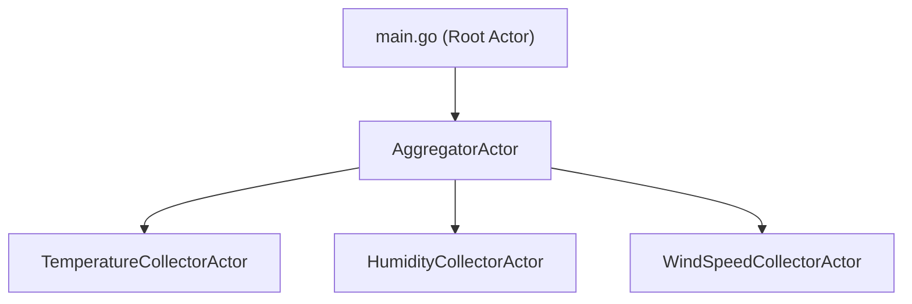
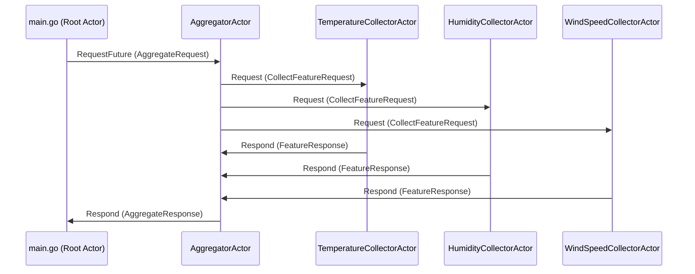

# go-scatter-gather-sample
protoactor-go scatter-gather pattern sample code

## samples
- [simple](./simple): simple app
- [db](./db): save data in db
- [fruits-trading-demo](./fruits-trading-demo): trading demo app

## Structure of simple/ and db/
### model


### Actor tree


### sequence



# Run
### simple
```
$ cd simple
$ go run .
```

### save result to postgresql db
```
$ cd db
$ docker-compose up -d
$ go run .
```
and manually check the db data

# init go
```
$ go mod init github.com/your_github_username/your_repository_name
$ go get github.com/asynkron/protoactor-go
$ go mod tidy
$ go run .
```
