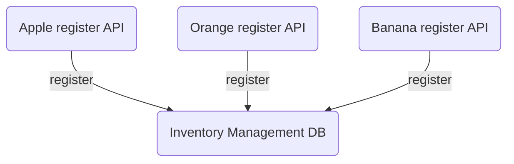
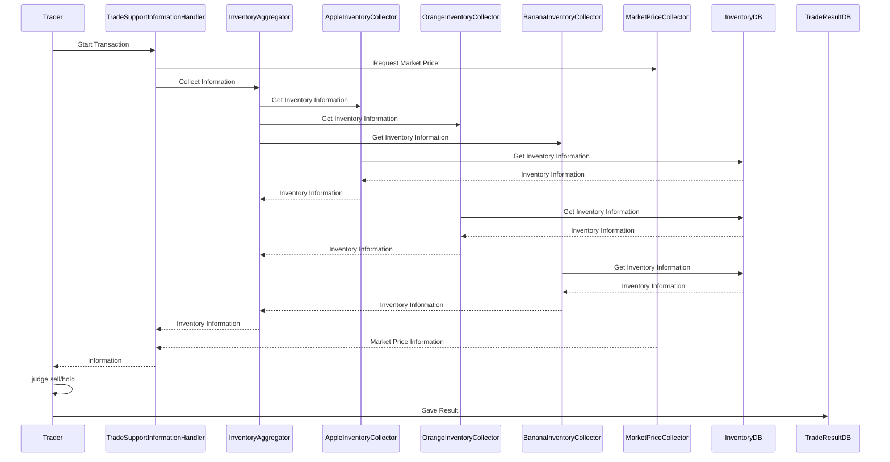
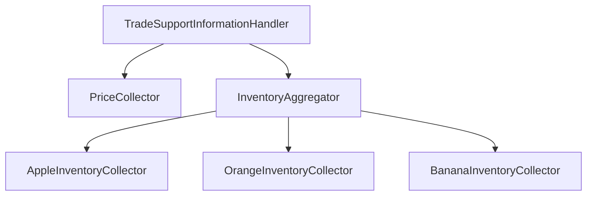

# fruits-trading-demo
trade fruits with actor model and scatter-gather pattern

## Usecases
### Register Purchasing


### Trade judgement



## Actor structure

## QuickStart
```
$ docker-compose up -d
$ go run .
```